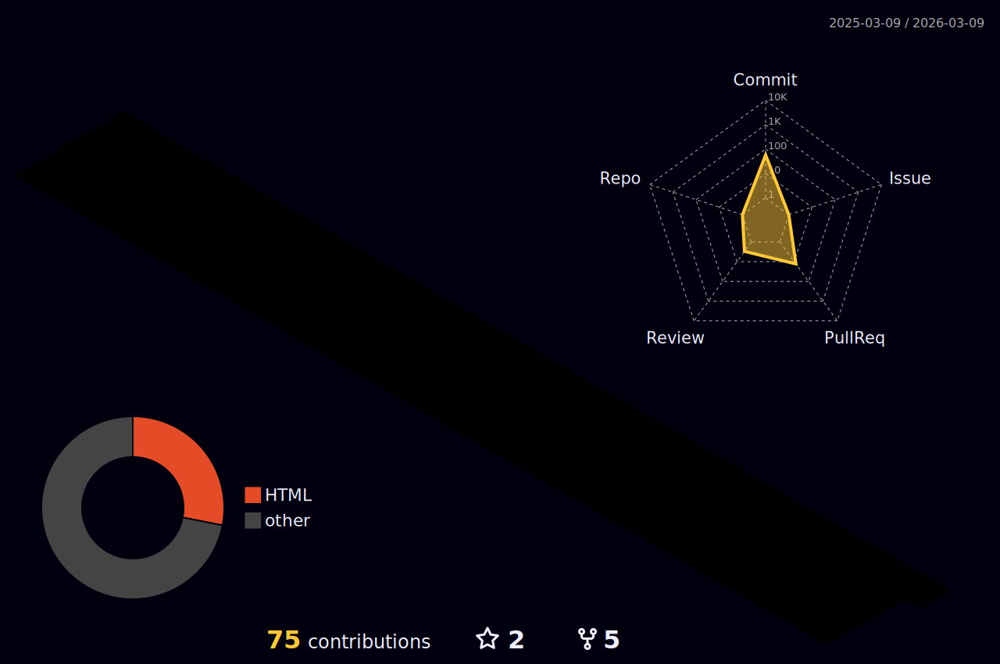

<div align="center">


<p>
    <a href="https://git.io/typing-svg"></a>
</p>
</div>

---

## Heyo :wave:

Seems you've found my profile. Nothing crazy to see here. But since you *are* here...

| **Projects**                                           | **Closed PRs**                                                                                                                             | **Lines**                                                                                          |
|--------------------------------------------------------|--------------------------------------------------------------------------------------------------------------------------------------------|----------------------------------------------------------------------------------------------------|
| [FlyByWire Docs](https://github.com/flybywiresim/docs) |   |  |


<details open>
    <summary><h3>About Me</h3></summary>
    
Experienced web developer adept in all stages of advanced web deployment and development. Effectively manages marketing projects from conception to completion utilizing automation and best
industry practices.

- Aviation enthusiast
- Gamer
- Believes french pressed coffee is the superior choice of brewing
</details>

<details open>
    <summary><h3>FlyByWire Simulations</h3></summary>

Long-standing member of the [FlyByWire Simulations](https://flybywiresim.com/) organization developing open source projects to create free high fidelity aircraft add-ons for Microsoft Flight 
Simulator. We are known for the Airbus A320neo add-on project "A32NX" featuring detailed system depth and functionality. 

I moderate and provide support on our Discord, help manage our marketing and blogs, and maintain our end-user documentation using [mkdocs-material](https://squidfunk.github.io/mkdocs-material/)!

- FlyByWire Simulations on GitHub - <kbd>[See More](https://github.com/flybywiresim)</kbd>
- FlyByWire Simulations Website - <kbd>[Download Our Products](https://flybywiresim.com)</kbd>
- A32NX GitHub repository - <kbd>[Contribute](https://github.com/flybywiresim/a32nx/)</kbd>
- FlyByWire Simulations Discord - <kbd>[Join Us](https://discord.gg/flybywire)</kbd>
</details>

<details>
    <summary><h3>Things I'm Learning 🌱</h3></summary>

- React
- TypeScript
</details>

## Stats



<!--START_SECTION:waka-->


**I'm a Night 🦉** 

```text
🌞 Morning                1507 commits        █████░░░░░░░░░░░░░░░░░░░░   18.37 % 
🌆 Daytime                2196 commits        ███████░░░░░░░░░░░░░░░░░░   26.77 % 
🌃 Evening                2376 commits        ███████░░░░░░░░░░░░░░░░░░   28.97 % 
🌙 Night                  2123 commits        ██████░░░░░░░░░░░░░░░░░░░   25.88 % 
```


📊 **This Week I Spent My Time On** 

```text
💬 Programming Languages: 
YAML                     10 hrs 25 mins      ███████████████░░░░░░░░░░   61.67 % 
Markdown                 5 hrs 22 mins       ████████░░░░░░░░░░░░░░░░░   31.79 % 
Text                     30 mins             █░░░░░░░░░░░░░░░░░░░░░░░░   03.03 % 
CSS                      24 mins             █░░░░░░░░░░░░░░░░░░░░░░░░   02.38 % 
HTML                     6 mins              ░░░░░░░░░░░░░░░░░░░░░░░░░   00.64 % 

🔥 Editors: 
IntelliJ                 16 hrs 54 mins      █████████████████████████   100.00 % 

🐱‍💻 Projects: 
test-mk                  10 hrs 49 mins      ████████████████░░░░░░░░░   64.03 % 
docs                     5 hrs 9 mins        ████████░░░░░░░░░░░░░░░░░   30.47 % 
project-woody            55 mins             █░░░░░░░░░░░░░░░░░░░░░░░░   05.51 % 
```

**I Mostly Code in JavaScript** 

```text
JavaScript               3 repos             ███████░░░░░░░░░░░░░░░░░░   27.27 % 
HTML                     3 repos             ███████░░░░░░░░░░░░░░░░░░   27.27 % 
TypeScript               3 repos             ███████░░░░░░░░░░░░░░░░░░   27.27 % 
Batchfile                1 repo              ██░░░░░░░░░░░░░░░░░░░░░░░   09.09 % 
Python                   1 repo              ██░░░░░░░░░░░░░░░░░░░░░░░   09.09 % 
```


 Last Updated on 28/03/2023 12:56:10 UTC
<!--END_SECTION:waka-->

---
<sub>Photo in banner by <a href="https://unsplash.com/@synkevych?utm_source=unsplash&utm_medium=referral&utm_content=creditCopyText">Roman Synkevych 🇺🇦</a> on <a href="https://unsplash.com/photos/vXInUOv1n84?utm_source=unsplash&utm_medium=referral&utm_content=creditCopyText">Unsplash</a></sub>


<!--
**Valastiri/Valastiri** is a ✨ _special_ ✨ repository because its `README.md` (this file) appears on your GitHub profile.

Here are some ideas to get you started:

- 🔭 I’m currently working on ...
- 🌱 I’m currently learning ...
- 👯 I’m looking to collaborate on ...
- 🤔 I’m looking for help with ...
- 💬 Ask me about ...
- 📫 How to reach me: ...
- 😄 Pronouns: ...
- ⚡ Fun fact: ...
-->
