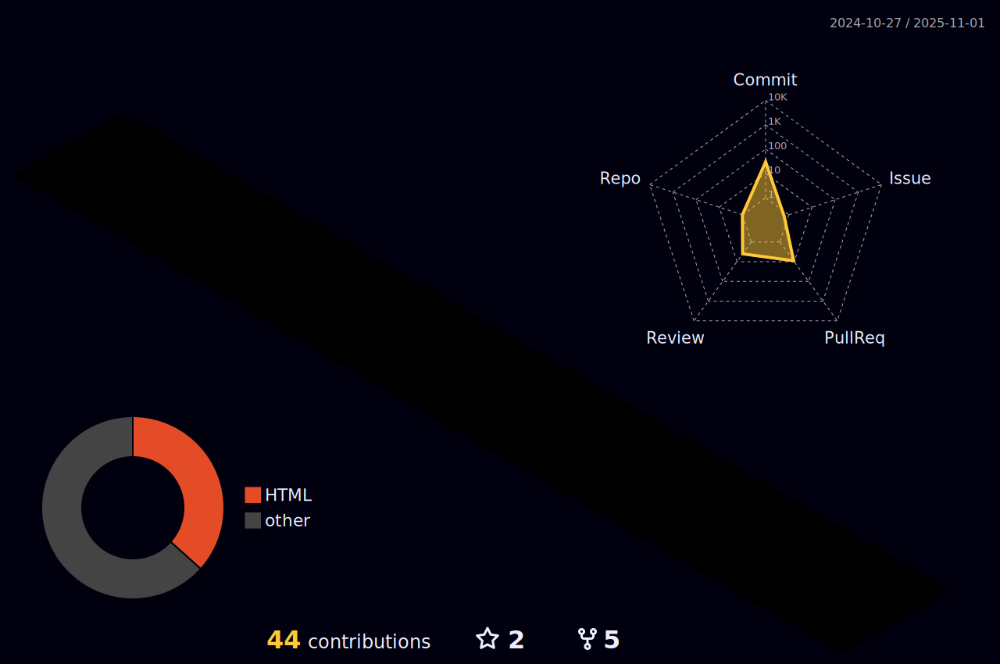

<h1 align="center"> Alex R. (Valastiri)</h1>

    

---

## Heyo :wave:

Seems you've found my profile. Nothing crazy to see here. But since you *are* here...
- Aviation Enthusiast
- Gamer

Long standing member of the [FlyByWire Simulations](https://flybywiresim.com/) organization working on the [A32NX](https://github.com/flybywiresim/a32nx/) for Microsoft Flight Simulator. 
I assist with support and moderation on our Discord, help manage our marketing, and maintain our end-user documentation!

### Things I'm Learning
- React
- TypeScript

| **Projects**                                           | **Closed PRs**                                                                                                                             | **Lines**                                                                                          |
|--------------------------------------------------------|--------------------------------------------------------------------------------------------------------------------------------------------|----------------------------------------------------------------------------------------------------|
| [FlyByWire Docs](https://github.com/flybywiresim/docs) |   |  |

<!--
**Valastiri/Valastiri** is a ✨ _special_ ✨ repository because its `README.md` (this file) appears on your GitHub profile.

Here are some ideas to get you started:

- 🔭 I’m currently working on ...
- 🌱 I’m currently learning ...
- 👯 I’m looking to collaborate on ...
- 🤔 I’m looking for help with ...
- 💬 Ask me about ...
- 📫 How to reach me: ...
- 😄 Pronouns: ...
- ⚡ Fun fact: ...
-->
